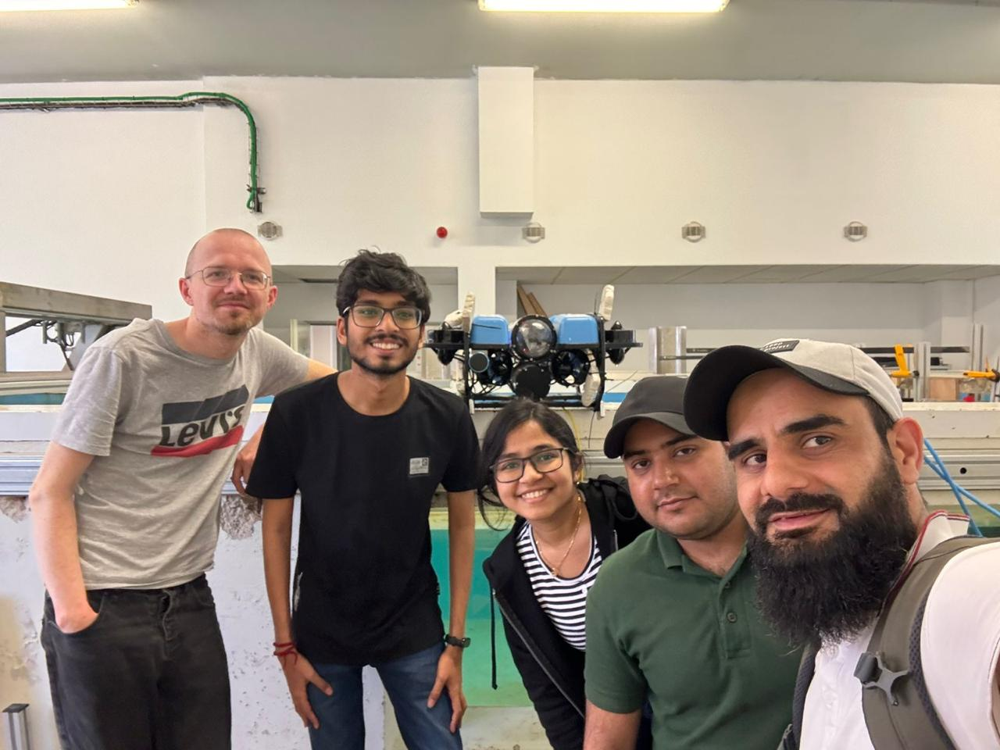
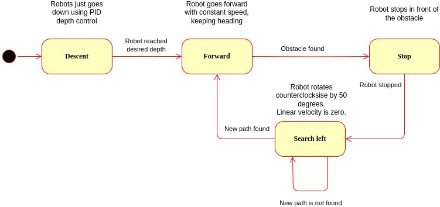
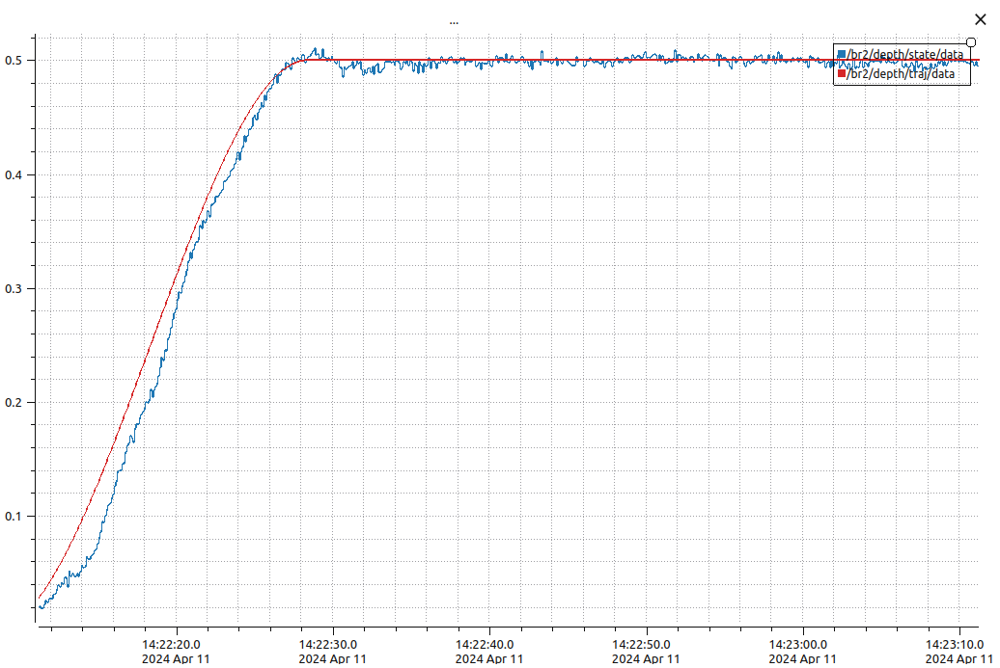
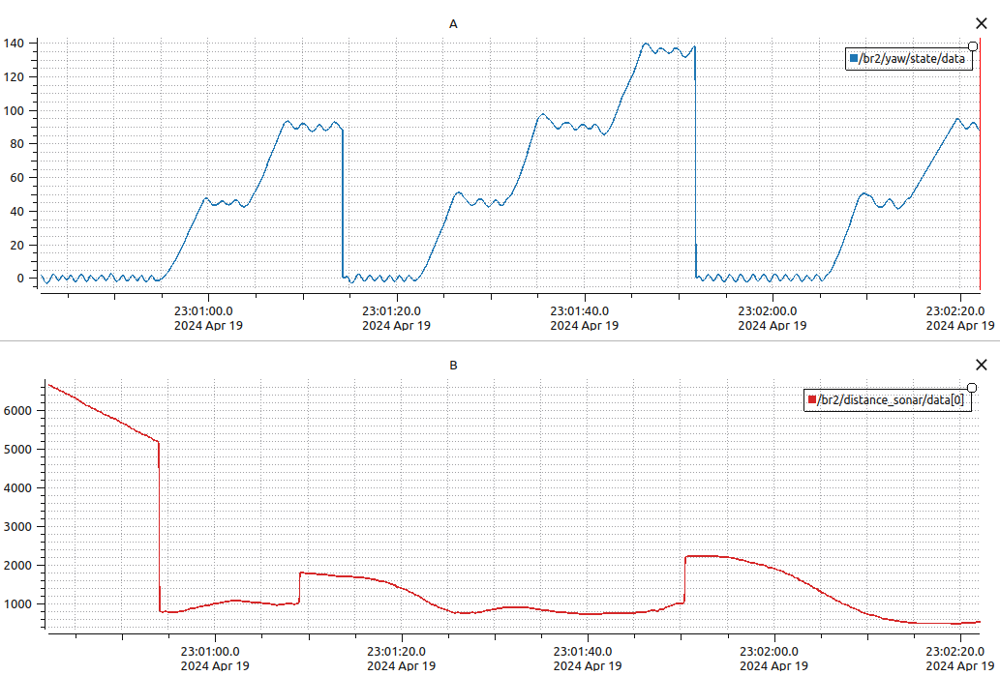
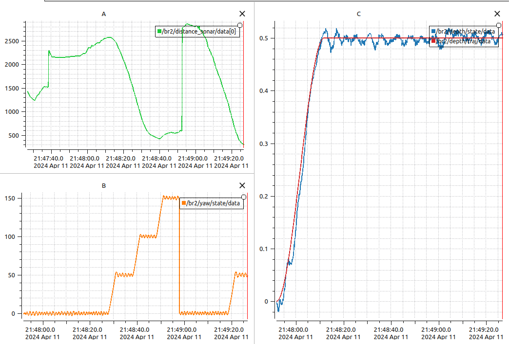

<h1 align="center">Autonomous Behaviour in BlueROV</h1>

<div align="center">

</div>
 
### Objective:

This project aims to create autonomous behaviour for the BlueROV underwater vehicle.  The primary objectives of this project include maintaining a fixed heading while moving forward, detecting obstacles, halting at a safe distance from said obstacles, and subsequently navigating around them to continue forward motion. The work was carried out under the supervision of Prof. Vincent Hugel from the University of Toulon and Prof. Vincent Creuze from the University of Montpellier.

Group Members:

* [Abhimanyu Bhowmik](https://github.com/abhimanyubhowmik)
* [Madhushree Sannigrahi](https://github.com/Madhushree2000)
* [Chashnikov Sergei](https://www.linkedin.com/in/schashni/)
* [Tayyab Tahir](https://www.linkedin.com/in/tayyab-tahir-99ab74162/)
* [Bhat Ishfaq](https://www.linkedin.com/in/bhat-ishfaq/)

<div align="center">

<p>Our group at the COSMER Lab water tank at the Université de Toulon</p>
</div>


### How to Use:

* Prequisites:

    Linux 20.04 or 18.04 LTS

    ROS: Melodic for ubuntu 18.04, Neotic for 20.04

    Installation of mavros locally. 

    It also possible to install mavros packages from the network but some code may not be compatible any more with the embbedded version.


* Cloning the Project Repository : 
```git@github.com:abhimanyubhowmik/Autonomous_Behavior_BlueROV.git```

```
sudo apt-get install ros-melodic-joy

cd bluerov_ws
catkin build
catkin build -j1 -v

# Running Autonomous Behaviour

source devel/setup.bash
roslaunch autonomous_rov run_use_autonomous.launch

# Manual Control

source devel/setup.bash
roslaunch autonomous_rov run_visual_servoing.launch
```


### Overview

Key components of this project include the trajectory-following PID controller for depth control, the P controller for heading and yaw control, and the Ping Sonar Echosounder for obstacle detection. The sensors used include an Inertial Measurement Unit (IMU) for obtaining yaw angle measurements and a frontal echosounder pinger for determining the distance to obstacles in the forward direction of the BlueROV. The obstacles comprise the tank wall, specific vertical wooden boards strategically placed within the tank environment, and other BlueROVs in the tank. This practical lab serves as an exploration of marine mechatronics, where we'll integrate theory with hands-on experience to develop autonomous capabilities in underwater vehicles.

<div align="center">

<p>Overall algorithm of the system as Finite State Machine</p>
</div>
Our task was to implement controllers for depth and heading control, as well as obstacle detection and avoidance algorithms. The entire code is executed as Finite State Machine, specifying particular events as a change of space. The code structure was complex, but by using the Finite State Machine paradigm, we were able to break the overall behaviour of the robot into Descent, Forward, Stop, and Search Left states. The corresponding state machine diagram is given in Figure.

---

### Descent

When the robot enters this state, it starts descending to the desired depth. In our case, we set the depth to **0.5 meters**. 

A PID controller is implemented to reach the desired depth along a fixed trajectory and maintain it. The control output ($\tau_{\text{PID}}$) is computed by incorporating proportional, integral, and derivative terms, alongside floatability compensation:

$$
\tau_{\text{PID}} = K_p \tilde{z} + K_i \int \tilde{z}(t) \,dt + K_d \dot{\tilde{z}} + \text{floatability compensation}
$$

Here:  
- $\tilde{z} = z_{\text{des}} - z$: Represents the depth error.  
- $\dot{\tilde{z}} = \dot{z}_{\text{desired}} - \dot{z}$: Represents the error in heave speed.  
- $K_p$, $K_i$, and $K_d$: Proportional, integral, and derivative gains, respectively.

We used the following values for gains:  
$K_p = 120$, $K_i = 10$, $K_d = 2$.

The integral term accumulates error over time to handle steady-state errors, while the derivative term accounts for the error's rate of change, enhancing quick response and stability.


#### Heave Speed Estimation
Since the ROV does not have sensors to directly measure the vertical speed (heave) of the robot, an alpha-beta filter (a simpler version of the Kalman filter) was implemented to estimate the speed. The update equations are:

$$
x_k = x_{k-1} + (v_{k-1} \cdot dt)
$$
$$
r_k = x_m - x_k
$$
$$
x_k += \alpha \cdot r_k
$$
$$
v_k += \frac{\beta \cdot r_k}{dt}
$$

By adjusting the values of $\alpha$ and $\beta$ and updating the values of $x_k$ and $r_k$, the heave speed can be estimated. 

In our implementation, we used the default values:  
$\alpha = 0.1$, $\beta = 0.005$.

---

### Forward
In the **Forward** state robot keeps the constant surge speed and constant heading. Also, we control the distance to the obstacle in front of the robot.
Constant speed for the surge is set in $pingerCallback$ function. We used value 0.00001 for $forward\_ speed$ variable.

#### Yaw Control 
Constant heading is implemented in $OdoCallback$ function. When this function is called (new data from IMU is received), following steps are done:
 - We start by converting the orientation feedback of the robot's
IMU (in quaternions) into Euler angles. We get our roll, pitch and yaw angles from here.

- The initial yaw angle is saved when the ROV is turned to autonomous mode. After that, for each callback, we check the difference between the $initial\_ yaw$ and $current\_ yaw$ angle.
-  We use a P-controller to minimize this error and adjust the yaw angle of the ROV accordingly. This ensures a steady heading angle when the ROV is in the **forward** state and helps maintain stability during navigation.
- The yaw angle, that is, obtained from IMU measurements, is in range $ [0, 360] $ degrees. This can lead to the following problems:
    - Inadequate control value when the robot is stabilising around zero-degree angle.
    - Overly large rotations. For example, when robot should rotate from $10 \degree$ to $270 \degree$. From common sense it is obvious, that the correct way to fulfill this rotation is to go $100 \degree$ counter-clockwise, but not $260 \degree$ clockwise. 
#### Distance Control

Distance is measured by an ultrasound sensor mounted on the robot. When the distance is lower than the given threshold (variable $desired\_ distance$), the state changes to  **stop**.
Control of the distance is implemented in $ pingerCallback $ function

---

### Stop

The implementation of this state is done in $OdoCallback$ function. The robot just switches to the $search\_ left$ state and saves the moment of time corresponding to the start of the turn.
- In this state robot turns counter-clockwise by $ 50 \degree $ and after this check is there still an obstacle in front of him.
- Exploration of the free path is done in $pingerCallback$ function itself. The robot checks that turn started 10 seconds ago and then checks the presence of the obstacle. If there is no obstacle, it starts moving forward **forward**, otherwise, it turns again by $ 50\degree $. 10-second pause is added to prevent obtaining inadequate measurements from the distance sensor.


### Results and Discussion


#### Depth Control using PID
We achieved good heave control using a PID controller along a fixed trajectory. We got our best results with K\_p = 120, K\_i = 10, and K\_d = 2, maintaining a constant depth of 0.5m. These parameters allowed us to minimize overshoot and achieve a smooth response during our testing. The depth pressure graph of BlueROV along with the trajectory is presented in Figure.

<div align="center">

<p>Depth along with the Trajectory</p>
</div>


#### Acoustic servoing in the Surface
After heave, we attempted to implement the acoustic servoing on the surface. The objective was to detect the walls of the pool or any other obstacle in front of the ROV and stop the ROV at an approximately 70cm distance. However, due to inertial drift, we kept the desired distance at 120cm and the thrusters were kept at its lowest power. A constant oscillation in yaw is observed as the ROV tries to maintain the correct heading angle. For the heading control, a simple P-controller was implemented using K\_p = 0.000001.

<div align="center">

<p>(A) The heading angle of the ROV (B) Distance of the obstacle from the ROV</p>
</div>

We also managed to merge the heave and heading control on the ROV. Here, 2 different PIDs were working together. There was some drift in the heading when the state changed from "Forward" to "Stop" due to inertia. The ROV overall succeeded in acoustics servoing and obstacle avoidance while maintaining a constant depth. The depth pressure graph along with yaw control is portrayed in Figure.

<div align="center">

<p>(A) Distance measured by pinger. (b) Yaw angle from IMU sensor. (C) Depth of BlueROV with trajectory.</p>
</div>


